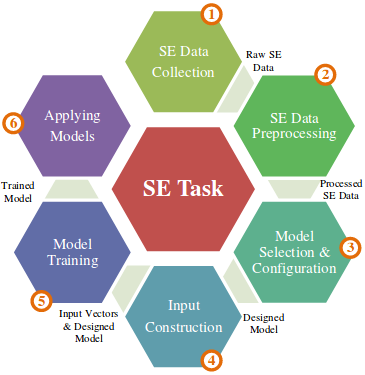
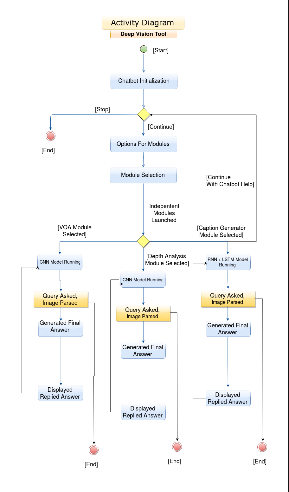
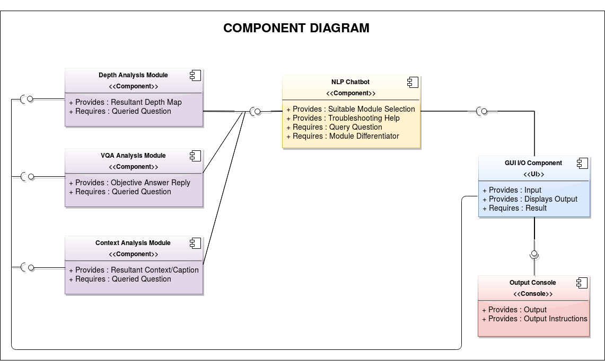
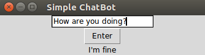

# Introduction


These repositories contains deep learning modules to perform a POC of a software in progress that will be able to perform all
image related analysis like VQA, activity classification and depth-map analysis specifically. Also, the queries will be handled by
a chatbot which can be seperate module on its own. Each and every module also is having a command line interface with independant
functioning.   
Ideal functionality for this software is to extract maximum information out of feeded images and its ability to understanding the
context of queries in more natural language manner. Hence, with that aim in mind the combined software is being developed.  

Now carrying on the discussion for specific modules and their functionalities.
These repositories will contain deep learning projects, with their trained models and all the related files to it for use.
Toy projects of deep learning is not aim for this repository collection instead projects with some real implications will
be selected to work with. Other than general information extraction, models are being trained to function around for specific
use-cases in different domains.
Also, alternative approaches to deep learning models their efficiency, ease of use and throughput for particular use-case will
be discussed. Consider, for example a flow based chatbot functioning with mutliple if-else cases but still being able to get the job done. But limited by its inability to handle all the cases in hand. Currently, aim is to restrict ourself to limited four modules only and implement them in different manners,
study their efficiency with deep learning models. Hopefully, create newer model architecture also as per need.

Current use cases under test involves, In Progress:

|   __Modules__               |               __Use Cases__                   |
|:----------------------------|:----------------------------------------------|
| __Chatbot__                 | TroubleShooting, Personality, Recruiting      |
| __VQA__                     | Product, Brand Identification, Recommendation |
| __Activity Classification__ | Audio and Visual Aid, Education               |
| __Depth Map Analysis__      | Realtime Audio and Visual Aid                 |

Also, alterative approaches will be explored for implementing these use-cases. And comparative case-study will be documented.
This website will contain the following content related to project

# Contents 
  * Complete Working Explained
    * Important Code snippets
  * Design Diagrams
  
  * UI Design
    * Code
  * Testing Plan
  
  * Literatue Review
  
  * References, Acknowledgements And Credits
  
* * *

# Working & Functionality

  
Diagram representing software engineering practices for deep learning models.

* * *

# Design Diagrams

__Current Design Workings:__ In the working of Deep Vision tool the main UI will prompt options to use a specific module for that particular task. After that selection that particular module will get triggered and control will get transfered to that module for information extraction. Main UI will still work and can launch other submodules.  



The flow of main UI is highlighted by this diagram. Along, with encoder-decoder process on a trained dataset with annotations already labelled on them.



This diagram how this software can be divided into different components in terms of functionality and modular nature to achieve
independent performance. With initial flow based chatbot for querying from the information extraction modules.   

* * *

# UI Design & Functionality

GUI programming is different from control flow programming which is a control flow one but gui programming is __event driven__ programming. Set everything up and wait for event generated by user's actions, then code responds.  

Consider this simple __flow-based__ chatbot with __hard-coded strings__ for input & response with enter button.  

```
def func():
  # flow-logic
  # with if-else & case statements

# initialization of UI & packing user input into UI
root = tk.Tk()
user_input = tk.Entry(root)
user_input.pack()

# packing Button onto UI
button = tk.Button(root, text="Enter", command=func)
button.pack()

# packing output as Label text onto UI
output = tk.Label(root, text='')
output.pack()

# to keep the UI afloat
tk.mainloop()
```

  

But,`Enter` button and hard-coded strings are not ideal. Hence, we can replace hard-coded string with pattern matching with
__regex expressions__ with which we can trigger our individual modules. Also, we can bind callback to the Entry widget
so that it's called when the `Enter key` is pressed inside the Entry widget. Signature of callback modified, as now it will
receive Event Object when it is called.

```
def func():
  # flow-logic with regex expression to trigger modules
...

user_input.bind("<Return>", cb)
output = tk.Label(root, text='')
output.pack()

tk.mainloop()
```

Finally, the UI(_In Progress_) will contain regex pattern matching logic which will trigger on different independent modules in console. Tests for pattern matching logic and final UI demo will be added soon in this site. Another, alternate approach for UI is
web app approach currently in drawing and design form only.

* * *

# Testing Plan

## Model Testing

We __can't use__ k-fold cross validation and train-test approach in deep learning to evaluate the model. As, deep learning
models are __stochastic__ in nature. Artificial neural networks use randomness while being fit on a dataset, such as
random initial weights and random shuffling of data during each training epoch during stochastic gradient descent. It
may give different predictions and in turn have different overall skill. Our aim has to be minimize this randomness in model.
```
# Methods that cannot be used earlier on

# Test and train split
train, test = split(data)
model = fit(train.X, train.y)
predictions = model.predict(test.X)
skill = compare(test.y, predictions)

# k-fold cross-validation

scores = list()
for i in k:
	train, test = split_old(data, i)
	model = fit(train.X, train.y)
	predictions = model.predict(test.X)
	skill = compare(test.y, predictions)
	scores.append(skill)
# mean and standard deviations
mean_skill = sum(scores) / count(scores)
standard_deviation = sqrt(1/count(scores) * sum( (score - mean_skill)^2 ))

```
Additional randomness gives more flexibility but makes model less stable i.e. different results when model trained on same data.
To make robust model must take additional sources of variance into account.  

Fix Randomness seed for every time the model is fit. And then perform evaluation criteria as specified above.  

__Recommended and used__ approach in this project, __Repeated Evaluation Experiment__ repeat stochastic experiments to make
them more robust to changes. Estimated mean is calculated then, which is also known as __grand mean__. Recommended, to repreat
the experiments atleast 30 times, as per ideal standards.
```
scores = list()
for i in repeats:
	run_scores = list()
	for j in k:
		train, test = split_old(data, j)
		model = fit(train.X, train.y)
		predictions = model.predict(test.X)
		skill = compare(test.y, predictions)
		run_scores.append(skill)
	scores.append(mean(run_scores))
```
Standard error for mean model skill, estimated mean of model skill score differs from the unknown actual mean model skill.
Standard error can be used to calculate confidence interval of mean skill.
```
standard_error = standard_deviation / sqrt(count(scores))

interval = standard_error * 1.96
lower_interval = mean_skill - interval
upper_interval = mean_skill + interval
```


## UI Testing

For this testing multiple strings containing different keywords with respective queries will be entered to see if
desired module gets triggered or not with regex pattern matching.   
```
Examples for VQA analysis:

Hey, start VQA module.
Start the visual question answering module.
Open visaul question answering module.       # even wrong spelling must be handled.
VQA.
VQA module.
Objective question module.
VQA model.
Objective answering module.
Open/Start module 1.
Open/Start module one.
question answering objective module.
question answering visual module.
QA objective module.
QA Visual module.                           # upper, lower and camel cases handled.
visualquestionanswering module              # Space error handling.
objectivequestionanswering
```
From the above examples similar arguments for test cases can be extended for other modules and for closing these modules in
their respective independent console.  

* * *

# Literature Survey

* * *

# References

* * *
