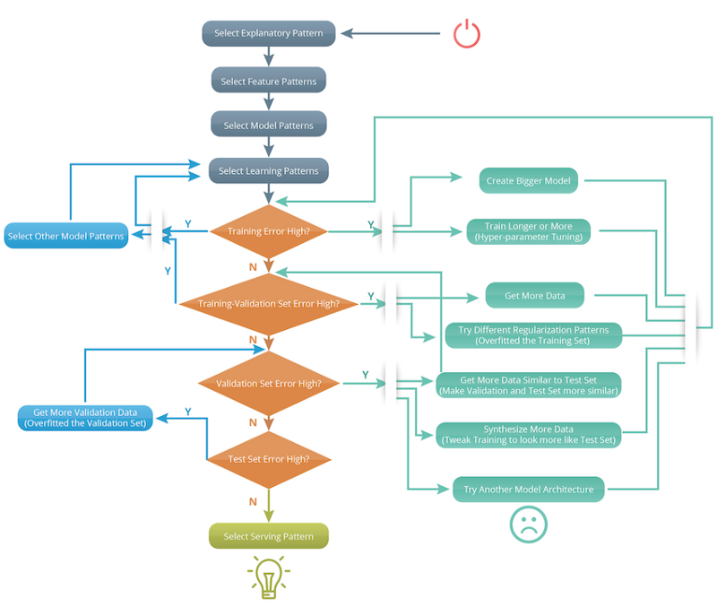
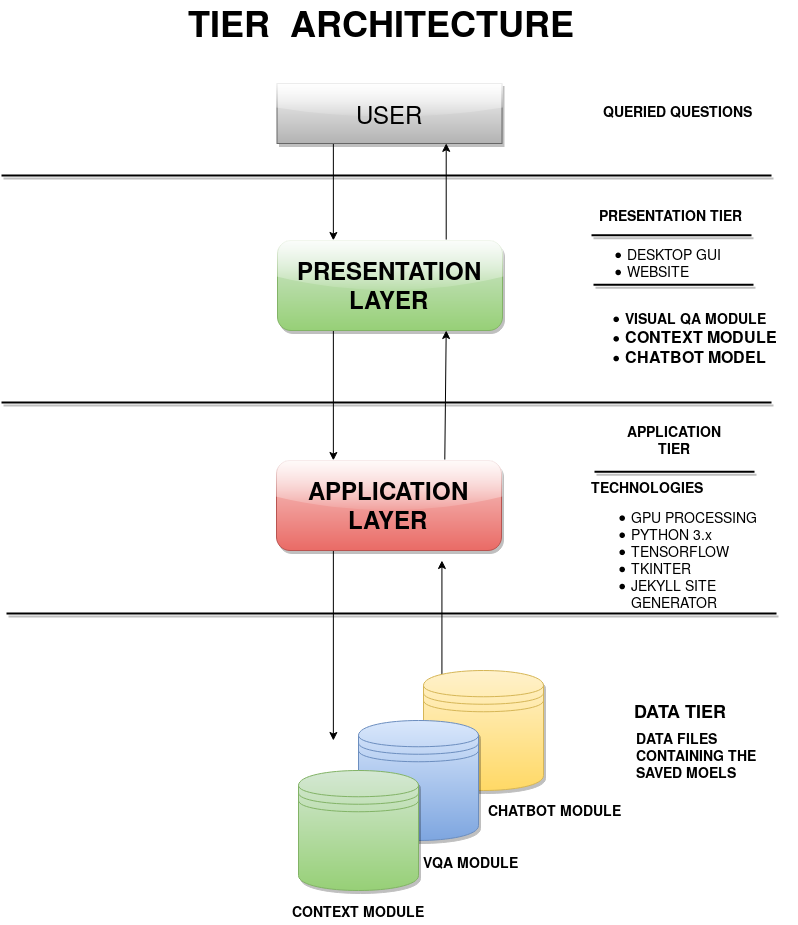

# Result Server

Provide Google drive link for images to be tested, resultant zip file will be returned via email back to you. Also, basic details about
your organization is required.  

No heavy lifting required. Our machines will run the tests for you. Just fill simple form below.  

<a href="form.html"> Fill form with DeepVision Centre </a>

* * *

# Introduction

These repositories contains deep learning modules to perform a POC on providing deep learning as service or software. Exploring
both these as an alternative for deployment of deep learning models serving as different modules in a package.

Chatbot which can be seperate module on its own will act as helper while using the application either a web-based one or GUI. Each and every module also is having a command line interface with independant functioning.  

Ideal functionality for this software is to extract maximum information out of input images and its ability to understanding the
context of queries in more natural manner. Hence, with that aim in mind the combined software is being developed.  

As a part of this POC two variants are prepared one a desktop version and another is client-server model. In Desktop GUI,
a basic flow-based chatbot will handle queries and trigger respective sub-modules. In client-server
model test images will be sent via
website to running server which will then return the results in the form of an email. As, a part of POC
this will be done manually. Chatbot Integration with website & automatic replies are not in place.

Now carrying on the discussion for specific modules and their functionalities.
These repositories will contain deep learning projects, with their trained models and all the related files to it for use.
Other than general information extraction, models are expected to function around for specific
use-cases in different domains.


Current use cases under test involves, In Progress:

|   __Modules__               |               __Use Cases__                   |
|:----------------------------|:----------------------------------------------|
| __Chatbot__                 | TroubleShooting, Personality                  |
| __VQA__                     | Product, Object Identification and Visual aid |
| __Activity Classification__ | Contextual and Visual Aid, Education          |

Also, alterative approaches will be explored for implementing these use-cases. And comparative case-study will be documented.
This website will contain the following content related to project

# Contents

  * Methodology
  
  * Design Diagrams
  
  * UI Design & Functionality
    * Code
  * Testing Plan
    * Model Testing
    * UI Testing
  * Model Architecture
  
* * *

# Methodology

Selection of network model and dataset is required, then check adequate training labels are available. Instead of conventional ML approach of three sets of training, validation and test, changes in model architecture and training time are done to achive performance improvements. A new architecture upon no improvement can be adopted.

Second step is to check against validation set to avoid any ovefitting. Regularization mechanism can be applied on such cases. If no improvements happens and test error stays high in the end trying different architecture until a proper fit will be best option.

  
_Diagram representing software practices for deep learning models._

The development process is referred as __software 2.0__ by AI Head of Tesla, where the emphasis is on developing a framework for neural network in which it can learn upon instead on standard SE development processes. Software 1.0 comprising of learning about 1's and 0's where as non-linear functions for learning paves the foundation.


_Feed forward auto encoders in working for learning weights and biases._

Parallel processing on NVIDIA GPUs helps in achieving faster training time to try out more models in given period of time.

* * *

# Design Diagrams

__Current Design Workings:__ In the working of Deep Vision tool the main UI will prompt options to use a specific module for that particular task. After that selection that particular module will get triggered and control will get transfered to that module for information extraction. Main UI will still work and can launch other submodules.  


The flow of main UI is highlighted by this diagram. Along, with encoder-decoder process on a trained dataset with annotations already labelled on them.  


This diagram how this software can be divided into different components in terms of functionality and modular nature to achieve
independent performance. With initial flow based chatbot for querying from the information extraction modules.  



This diagram explains Client Server architecture which is the final architecture that we have proposed in comparison to event-driven architecture of Python based Desktop GUIs.
* * *

# UI Design & Functionality

GUI programming is different from control flow programming which is a control flow one but gui programming is __event driven__ programming. Set everything up and wait for event generated by user's actions, then code responds.  

Consider this simple __flow-based__ chatbot with __hard-coded strings__ for input & response with enter button.  

```
def func():
  # flow-logic
  # with if-else & case statements

# initialization of UI & packing user input into UI
root = tk.Tk()
user_input = tk.Entry(root)
user_input.pack()

# packing Button onto UI
button = tk.Button(root, text="Enter", command=func)
button.pack()

# packing output as Label text onto UI
output = tk.Label(root, text='')
output.pack()

# to keep the UI afloat
tk.mainloop()
```

  

But,`Enter` button and hard-coded strings are not ideal. Hence, we can replace hard-coded string with pattern matching with
__regex expressions__ with which we can trigger our individual modules. Also, we can bind callback to the Entry widget
so that it's called when the `Enter key` is pressed inside the Entry widget. Signature of callback modified, as now it will
receive Event Object when it is called.

```
def func():
  # flow-logic with regex expression to trigger modules
...

user_input.bind("<Return>", cb)
output = tk.Label(root, text='')
output.pack()

tk.mainloop()
```

The UI will contain regex pattern matching logic which will trigger on different modules in console as a subprocess
as shown in below screenshot of [mainGUI.py](https://github.com/DeepVisionCentre/DeepVisionTool/blob/master/mainGUI.py) in [DeepVisionTool](https://github.com/DeepVisionCentre/DeepVisionTool) repository.


_GUI Schreenshot, with basic inroduction._


_GUI Schreenshot, with basic inroduction._

Along, with this server based approach is explored and implemented.
With capabilties to upload test images via this website being sent
onto an email-id for test.

* * *

# Testing Plan

## Model Testing

We __can't use__ k-fold cross validation and train-test approach in deep learning to evaluate the model. As, deep learning
models are __stochastic__ in nature. Artificial neural networks use randomness while being fit on a dataset, such as
random initial weights and random shuffling of data during each training epoch during stochastic gradient descent. It
may give different predictions and in turn have different overall skill. Our aim has to be minimize this randomness in model.
```
# Methods that cannot be used earlier on

# Test and train split
train, test = split(data)
model = fit(train.X, train.y)
predictions = model.predict(test.X)
skill = compare(test.y, predictions)

# k-fold cross-validation

scores = list()
for i in k:
	train, test = split_old(data, i)
	model = fit(train.X, train.y)
	predictions = model.predict(test.X)
	skill = compare(test.y, predictions)
	scores.append(skill)
# mean and standard deviations
mean_skill = sum(scores) / count(scores)
standard_deviation = sqrt(1/count(scores) * sum( (score - mean_skill)^2 ))

```
Additional randomness gives more flexibility but makes model less stable i.e. different results when model trained on same data.
To make robust model must take additional sources of variance into account.  

Fix Randomness seed for every time the model is fit. And then perform evaluation criteria as specified above.  

__Recommended and used__ approach in this project, __Repeated Evaluation Experiment__ repeat stochastic experiments to make
them more robust to changes. Estimated mean is calculated then, which is also known as __grand mean__. Recommended, to repreat
the experiments atleast 30 times, as per ideal standards.
```
scores = list()
for i in repeats:
	run_scores = list()
	for j in k:
		train, test = split_old(data, j)
		model = fit(train.X, train.y)
		predictions = model.predict(test.X)
		skill = compare(test.y, predictions)
		run_scores.append(skill)
	scores.append(mean(run_scores))
```
Standard error for mean model skill, estimated mean of model skill score differs from the unknown actual mean model skill.
Standard error can be used to calculate confidence interval of mean skill.
```
standard_error = standard_deviation / sqrt(count(scores))

interval = standard_error * 1.96
lower_interval = mean_skill - interval
upper_interval = mean_skill + interval
```


## UI Testing

For this testing multiple strings containing different keywords with respective queries will be entered to see if
desired module gets triggered or not with regex pattern matching. Key phrases
mentioned below, coded in `mainGUI.py` will be analyzed.  

```
nlp_chtbt_module_phrases = ['nlp','chatbot','deus','bot','talk','chat','0','zero']
obj_module_phrases = ['vqa','visual','objective','1','one']
cntxt_module_phrases = ['context','activity','classification','2','two']
help_phrases = ['help','hlp','pardon']

```

Help file will contain instructions for running the models and basic information about the project to get started with.

* * *

# Model Architecture

VGGNet consists of 16 convolutional layers and is very appealing because
of its very uniform architecture. However, VGGNet consists of 138 million
parameters takes much longer time to run. Architecture complexity remains
small.

__Why use convulations layers befor fully connected layer ?__

Imagine an image 224 x 224 x 3 pixels and FC layer as a direct first hidden
layer with 100,000 perceptrons, the total number of connections will
be 224*224*3*100000=15,02,800,000 =>15 billion parameters which is
impossible to process. Convolution and max pooling reduces complexity.


_VGG 16 model architecture demystified._

Number of parameters can be calculated either by direct method or
a layer by layer with model summary.

```
model.count_params()
model.summary()
```

Here, is a summary of all the parameters with layer wise calculations. Follow along for in-depth analysis.  

|         __Layers__        |         __Memory Taken__         |        __Parameter Calculations__        |
|:--------------------------|:---------------------------------|:-----------------------------------------|
|    INPUT: [224x224x3]     |      memory:  224*224*3=150K     |                params: 0                 |
|  CONV3-64: [224x224x64]   |     memory:  224*224*64=3.2M     |        params: (3*3*3)*64 = 1,728        |
|  CONV3-64: [224x224x64]   |     memory:  224*224*64=3.2M     |       params: (3*3*64)*64 = 36,864       |
|   POOL2: [112x112x64]     |     memory:  112*112*64=800K     |                params: 0                 |
|  CONV3-128: [112x112x128] |    memory:  112*112*128=1.6M     |       params: (3*3*64)*128 = 73,728      |
|  CONV3-128: [112x112x128] |    memory:  112*112*128=1.6M     |      params: (3*3*128)*128 = 147,456     |
|   POOL2: [56x56x128]      |     memory:  56*56*128=400K      |                params: 0                 |
|  CONV3-256: [56x56x256]   |     memory:  56*56*256=800K      |      params: (3*3*128)*256 = 294,912     |
|  CONV3-256: [56x56x256]   |     memory:  56*56*256=800K      |      params: (3*3*256)*256 = 589,824     |
|  CONV3-256: [56x56x256]   |     memory:  56*56*256=800K      |      params: (3*3*256)*256 = 589,824     |
|   POOL2: [28x28x256]      |     memory:  28*28*256=200K      |                params: 0                 |
|  CONV3-512: [28x28x512]   |     memory:  28*28*512=400K      |     params: (3*3*256)*512 = 1,179,648    |
|  CONV3-512: [28x28x512]   |     memory:  28*28*512=400K      |     params: (3*3*512)*512 = 2,359,296    |
|  CONV3-512: [28x28x512]   |     memory:  28*28*512=400K      |     params: (3*3*512)*512 = 2,359,296    |
|   POOL2: [14x14x512]      |     memory:  14*14*512=100K      |                params: 0                 |
|  CONV3-512: [14x14x512]   |     memory:  14*14*512=100K      |     params: (3*3*512)*512 = 2,359,296    |
|  CONV3-512: [14x14x512]   |     memory:  14*14*512=100K      |     params: (3*3*512)*512 = 2,359,296    |
|  CONV3-512: [14x14x512]   |     memory:  14*14*512=100K      |     params: (3*3*512)*512 = 2,359,296    |
|   POOL2: [7x7x512]        |     memory:  7*7*512=25K         |                params: 0                 |
|     FC: [1x1x4096]        |         memory:  4096            |    params: 7*7*512*4096 = 102,760,448    |
|     FC: [1x1x4096]        |         memory:  4096            |     params: 4096*4096 = 16,777,216       |
|     FC: [1x1x1000]        |         memory:  1000            |      params: 4096*1000 = 4,096,000       |

`TOTAL memory computations: 24M * 4 bytes ~= 96MB per image`  
Only forward computations was taken into account above, for backward the size grows approximately by twice per image.  
`TOTAL params: 138M parameters`  
Above calculations does gives an idea about complexity of these models and amount of computations required
for which GPUs are suitable choice instead of good old CPUs.

* * *
